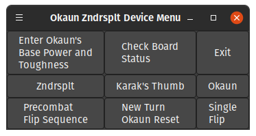

# Okaunzndrs

Code for a device that enhances the gameplay experience of the
MTG commander team pair, Zndrsplt and Okaun. Has the following features:
1. Coin Flips.
2. Lights and Sounds.
3. Calculate Okaun's new power and toughness. 

will later be connected to hardware.

Here is a screenshot!

To test: 

Download OZFunctions.py and OZ_gui.py into the same folder. At the terminal navigate to the directory containing both files and type `python3 OZ_gui.py` and press enter.
